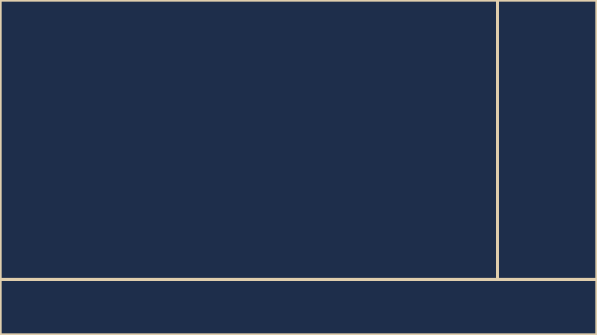

# Description

以下のような SVG ファイルを作成する。

Create an svg file that looks like the L frame.



[link to sample images](./images)

# Usage

requirements: Ruby

```bash

Usage: main [options]
        --input TEMPLATE_FILE
        --output FILE_NAME
        --main_width WIDTH
        --main_height HEIGHT
        --background_color COLOR
        --line_color COLOR

# (ex) output: 1600_900.svg
ruby main.rb --input template.svg.erb --main_width 1600 --main_height 900 --background_color "#1e2e4b" --line_color "#e0cead" --output 1600_900.svg

```

The template is 1920x1080.
Please change the template if necessary.

## SVG to PNG

Using [ImageMagick](https://imagemagick.org/index.php)

```bash
# (ex) output: 1600_900.png
convert 1600_900.svg 1600_900.png
```
